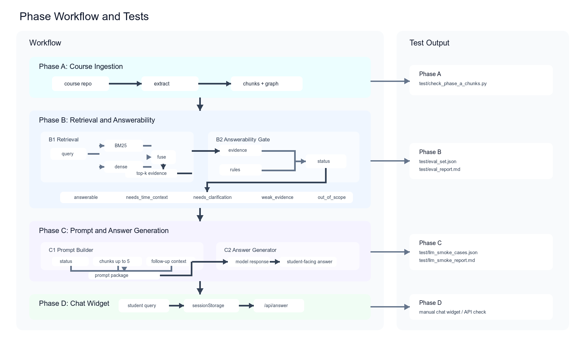
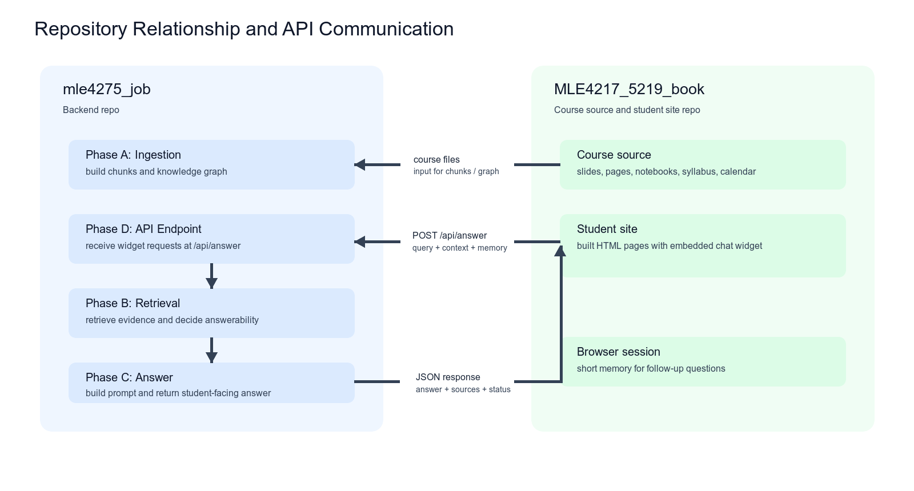

# Developer README

This document summarizes the project workflow, testing map, repository boundary, and current TODOs for developers working on the MLE4217/5219 AI Learning Agent.

## Critical Web Repository Rule

**Persistent user convention:** whenever the user says “create/build a webpage,”
“make another webpage,” “test the webpage,” “share the webpage,” or otherwise
refers to the course website, this always means working in the user's existing
sibling website repository at `../MLE4217_5219_book` and integrating or testing
the existing AI widget there.

Do **not** create a replacement course page, mock course site, standalone widget
test page, or newly designed website inside this backend repository unless the
user explicitly and unambiguously asks for a separate new page. Before any web
task, inspect `../MLE4217_5219_book`, preserve its existing layout and content,
and make only the changes needed to add, update, configure, or test its widget.

用户约定：用户说“建立网页”“再做一个网页”“测试网页”或“分享网页”时，永远指
现有的 `../MLE4217_5219_book` 网页仓库加上现有 widget；除非用户明确要求新建
独立网页，否则不得在本后端仓库重新设计或创建替代网页。

## Phase Workflow and Tests



The current system is organized as a staged RAG pipeline. Phase A extracts course
content from the sibling book repo into chunk records and metadata. Phase B runs
hybrid retrieval over those chunks, then applies an answerability gate before any
LLM call. Phase C packages selected evidence, short memory, and answer policy
into a prompt and sends it to the configured model provider. Phase D is the
Jupyter Book widget, which only calls the backend API. Phase E is deployment and
pilot testing.

Retrieval currently combines two signals:

- BM25 lexical search over normalized chunk text, weighted at `0.45`.
- Sentence-transformers embedding retrieval, weighted at `0.55`.

The retriever normalizes case and separators, expands a small alias table such as
`convexhull -> convex hull`, boosts exact phrase/title/path matches, downweights
figure-only chunks unless the query asks for figures, and applies a `+0.25`
boost to `syllabus.md` / `calendar.md` for logistics queries.

The answerability gate has five statuses:

| Status | Meaning |
| --- | --- |
| `answerable` | Retrieved course evidence is strong enough for an answer. |
| `needs_time_context` | The question is logistics/time-sensitive and must include the academic year/semester. |
| `needs_clarification` | The query is too broad and should be narrowed. |
| `weak_evidence` | Retrieved evidence is too weak to support a reliable answer. |
| `out_of_scope` | The question appears outside the course knowledge base. |

Current gate thresholds:

| Parameter | Value | Use |
| --- | --- | --- |
| `strong_score` | `0.72` | Baseline strong-evidence reference. |
| `weak_score` | `0.42` | Below this, return `weak_evidence`. |
| `min_embedding_score` | `0.18` | If BM25 is nearly zero and embedding is below this, return `weak_evidence`. |
| multi-source ratio | `0.72` | Top-5 results within 72% of the top score are considered close evidence. |
| prompt evidence threshold | `0.60` | Chunks at or above this score are sent as full-content LLM evidence. |

Short memory is intentionally small and session-scoped. The browser widget stores
recent turns in `sessionStorage`, so memory is cleared when the tab/window is
closed. The backend prompt builder keeps the most recent 4 memory items and
truncates each item to 1200 characters. For referential follow-ups containing
terms such as "this", "that", "it", or "they", retrieval also prepends up to the
last 4 memory items, truncated to 400 characters each, to make the search query
less ambiguous.

The LLM provider is configured through `.env`. The current local setup uses an
Anthropic-compatible API through `ANTHROPIC_BASE_URL`,
`ANTHROPIC_AUTH_TOKEN`, and `ANTHROPIC_MODEL`. The `.env` file is ignored by git
and should not be committed.

## Repository Relationship



The book repo and backend repo are intentionally separate. The book repo owns the
course content, generated site, and small student-facing widget. This repo owns
Phase A extraction outputs, retrieval, answerability, prompts, model providers,
evaluations, and the backend `/api/answer` route.

The two repos communicate through a narrow API contract:

```text
book widget -> POST /api/answer/stream -> backend RAG pipeline
```

The widget consumes newline-delimited `start`, `delta`, and `done` events. The
buffered `/api/answer` route remains available for scripts and evaluations.

The book repo should not store API keys, retrieval code, prompts, provider logic,
or chunk data. This repo should not edit course source content unless explicitly
requested. When the book content changes, rerun extraction and evaluation from
this repo using the sibling path `../MLE4217_5219_book`.

Syllabus/calendar answers are time-aware by design. Logistics answers must state
the applicable academic year and semester; current extracted logistics content is
marked as **AY2025/2026 Semester 2**.

## Local API and Course-Widget Tools

Create the ignored local API settings file from the safe template, edit its
three exports, then load it into the current shell:

```bash
cp scripts/api_env.example.sh scripts/api_env.sh
source scripts/api_env.sh
```

Start the backend and open the widget inside the existing sibling course site:

```bash
python scripts/start_course_widget_test.py
```

Pass `--build` when course source content changed; otherwise the tool only
refreshes the widget assets in the existing build. Stop both local services with
`Ctrl+C`.

## TODO

### Phase A: Course Ingestion

1. Document and test the book update workflow: preserve `ai_agent_widget/`, preserve Makefile injection, rerun extraction/evaluation, and verify API connection.

### Phase B: Retrieval and Answerability

2. Improve typo, spacing, and case tolerance for queries such as `convexhull`, `convax hull`, and `materialsproject`.
3. Handle questions that require multiple chunks or multiple files without forcing all evidence into one source.
4. Define behavior for no-result or weak-evidence questions, including clarification, nearby concept suggestions, or refusal.

### Phase C: Answer Generation

5. Add optional web fallback only when course evidence is insufficient and the question genuinely needs external/current information.
6. Add API retry and fallback behavior for transient provider failures.
7. Define answer length policy for definitions, code/workflow questions, review questions, weak evidence, and out-of-scope cases.
8. Add recommended follow-up questions after answers.
9. Add and confirm the expected answer for: `how to combine the static job and MD simulation job in atomate2`.

### Phase D: Book Widget

10. Make source locations clickable so students can jump from an answer to the relevant book chapter or section.

### Phase E: Deployment and Pilot

11. Define deployment and pilot workflow for the static book site, backend API, URL configuration, feedback collection, and evaluation metrics.
